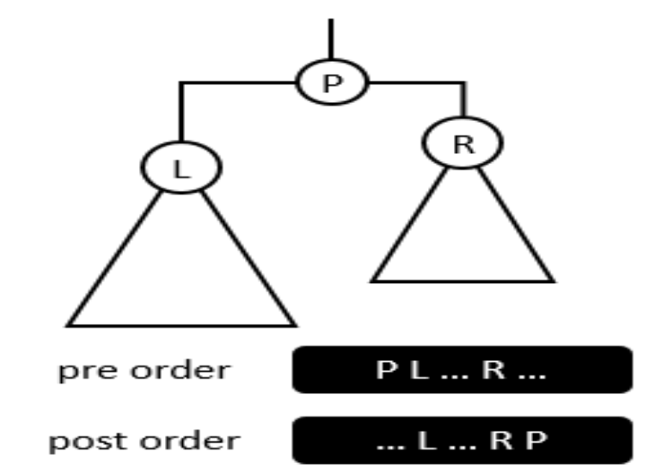

# Assignment-2 Report

## 1 Query Intervals

### 1.1 题目分析

#### 1.1.1 解题思路

本题使用一个较大数组，在输入时对应下标加一

输入完毕后，有  $\text{number[i]} = n(i)$ ，$n(i)$ 为数字i的个数

再遍历整个数组，执行 `number[i] += number[i-1];` ，此时 $\text{number[i]} = n(x|x \leq i)$ 

在闭区间 [a, b] 中数字的个数即为 $\text{number[a] - number[b-1]}$

* 其中 $b=0$ 的情况需要特判，避免访问越界，个数为$\text{number[a]}$

#### 1.1.2 复杂度分析

遍历整个数组，复杂度 $O(MAX)$

### 1.2 代码实现

```cpp
#include <cstdio>

#define MAX 10000001

int number[MAX] = {0};

int main()
{
    int n, m;
    scanf("%d %d", &n, &m);

    int x;
    for (int i=0; i<n; i++)
    {
        scanf("%d", &x);
        number[x]++;
    }

    for (int i=1; i<MAX; i++)
    {
        number[i] += number[i-1]; // number[i]记录的是<=i的数的个数
    }

    int range_left, range_right;
    for (int i=0; i<m; i++)
    {
        scanf("%d %d", &range_left, &range_right);
        if(range_left > 0)
            printf("%d\n", number[range_right] - number[range_left-1]);
        else
            printf("%d\n", number[range_right]);
    }

    return 0;
}

```

## 2 Binary Tree

### 2.1 题目分析

#### 2.1.1 解题思路



参考上图，由“真二叉树”的前序序列与后序序列，可以找到根节点、左孩子与左树、右孩子与右树

再对左右树进行递归重建中序序列

#### 2.1.2 复杂度分析

搜索复杂度 $O(n)$ 

总复杂度 $O(n \log n)$

### 2.2 代码实现

```cpp
#include <cstdio>

#define LEN 4000000

int pre[LEN], in[LEN], post[LEN];

int search(int *array, int x, int left, int right); // 在无序array的[left, right)区间内查找x，返回下标

void build_tree(int in_left, int in_right,
                int pre_left, int pre_right,
                int post_left, int post_right); // 左闭右开

int main()
{
    int n;
    scanf("%d", &n);
    for (int i = 0; i < n; i++)
        scanf("%d", &pre[i]);
    for (int i = 0; i < n; i++)
        scanf("%d", &post[i]);

    build_tree(0, n, 0, n, 0, n);
    for (int i = 0; i < n; i++)
        printf("%d ", in[i]);

    return 0;
}

int search(int *array, int x, int left, int right)
{
    for (int i = left; i < right; i++)
    {
        if (array[i] == x)
            return i;
    }

    return -1;
}

void build_tree(int in_left, int in_right,
                int pre_left, int pre_right,
                int post_left, int post_right)
{
    if (in_left >= in_right)
        return;

    if (in_left == in_right-1)
    {
        in[in_left] = pre[pre_left];
        return;
    }

    int root = pre[pre_left];
    int left = pre[pre_left + 1];
    int right = post[post_right - 2];

    int left_index = search(post, left, post_left, post_right);
    // 左子树长度 left_index - post_left + 1
    build_tree(in_left, in_left + left_index - post_left + 1,
               pre_left + 1, pre_left + left_index - post_left + 2,
               post_left, left_index + 1);

    in[in_left + left_index - post_left + 1] = root;

    int right_index = pre_left + left_index - post_left + 2;
    // 右子树长度 pre_right - right_index
    build_tree(in_left + left_index - post_left + 2, in_right,
               right_index, pre_right,
               left_index + 1, post_right - 1);
}

```

## 3 Ball Game

### 3.1 题目分析

#### 3.1.1 解题思路

考虑 A 球与 B 球的相对个数

* A 比 B 少 k 个，C 的个数为M
  * 将前 $k + \frac{M-k}{2}$ 个球变为 A，其中除法为整除，下同
  * 将后 $\frac{M-k}{2}$ 个球变为 B
* A 比 B 多 k 个，C 的个数为M
  *  将后 $k + \frac{M-k}{2}$ 个球变为 B
  * 将前 $\frac{M-k}{2}$ 个球变为 A

处理完后遍历，若前一段的子数组中，A 球个数少于 B 球个数，则输出 False

不存在此情况为 True

#### 3.1.2 复杂度分析

$O(n)$ 

### 3.2 代码实现

```cpp
#include <cstdio>

#define LEN 10000

char balls[LEN];

int main()
{
    int n;
    scanf("%d", &n);

    int num[3] = {0}; // 0-A 1-B 2-C

    for (int i=0; i<n; i++)
    {
        scanf(" %c", &balls[i]);
        num[(int)(balls[i] - 'A')]++;
    }

    if (num[0] <= num[1]) // A <= B
    {
        int k = num[1] - num[0];
        int M = num[2];

        if (k > M)
        {
            printf("False\n");
            return 0;
        }

        int count_c_dealed = 0;
        for (int i=0; count_c_dealed < k + (M-k)/2; i++)
        {
            if (balls[i] == 'C')
            {
                balls[i] = 'A';
                count_c_dealed++;
            }
        }
        count_c_dealed = 0;
        for (int i=n-1; count_c_dealed < (M-k)/2; i--)
        {
            if (balls[i] == 'C')
            {
                balls[i] = 'B';
                count_c_dealed++;
            }
        }
    }
    else // A>B
    {
        int k = num[0] - num[1];
        int M = num[2];

        if (k > M)
        {
            printf("False\n");
            return 0;
        }

        int count_c_dealed = 0;
        for (int i=n-1; count_c_dealed < k + (M-k)/2; i--)
        {
            if (balls[i] == 'C')
            {
                balls[i] = 'B';
                count_c_dealed++;
            }
        }
        count_c_dealed = 0;
        for (int i=0; count_c_dealed < (M-k)/2; i++)
        {
            if (balls[i] == 'C')
            {
                balls[i] = 'A';
                count_c_dealed++;
            }
        }
    }

    int count_a = 0, count_b = 0;
    for (int i=0; i<n; i++)
    {
        if (balls[i] == 'A')
        {
            count_a++;
        }
        else if (balls[i] == 'B')
        {
            count_b++;
        }

        if (count_b > count_a)
        {
            printf("False\n");
            return 0;
        }
    }

    printf("True\n");

    return 0;
}
```
